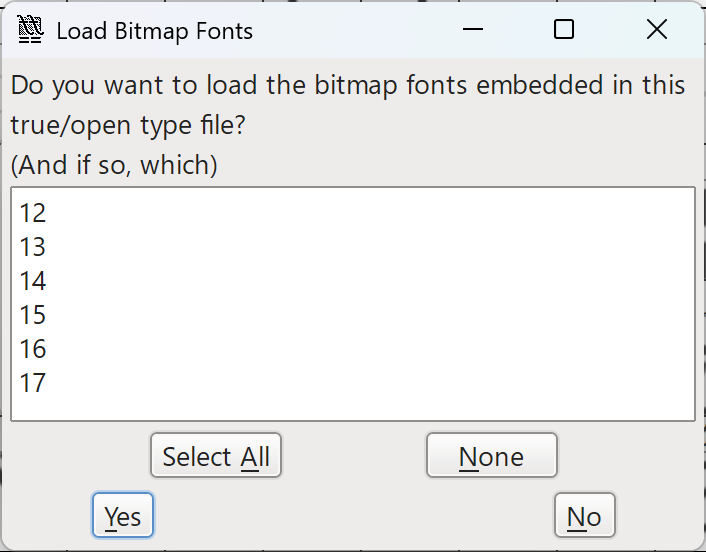
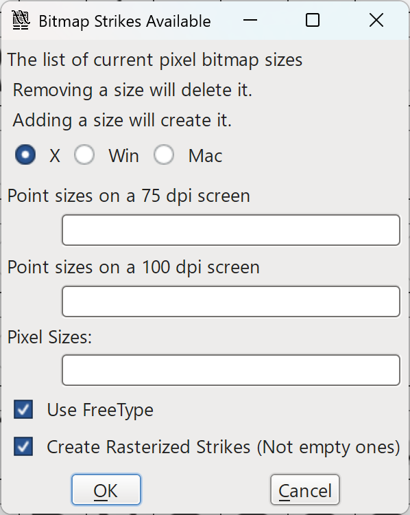
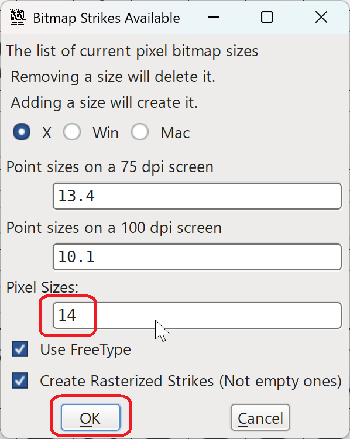
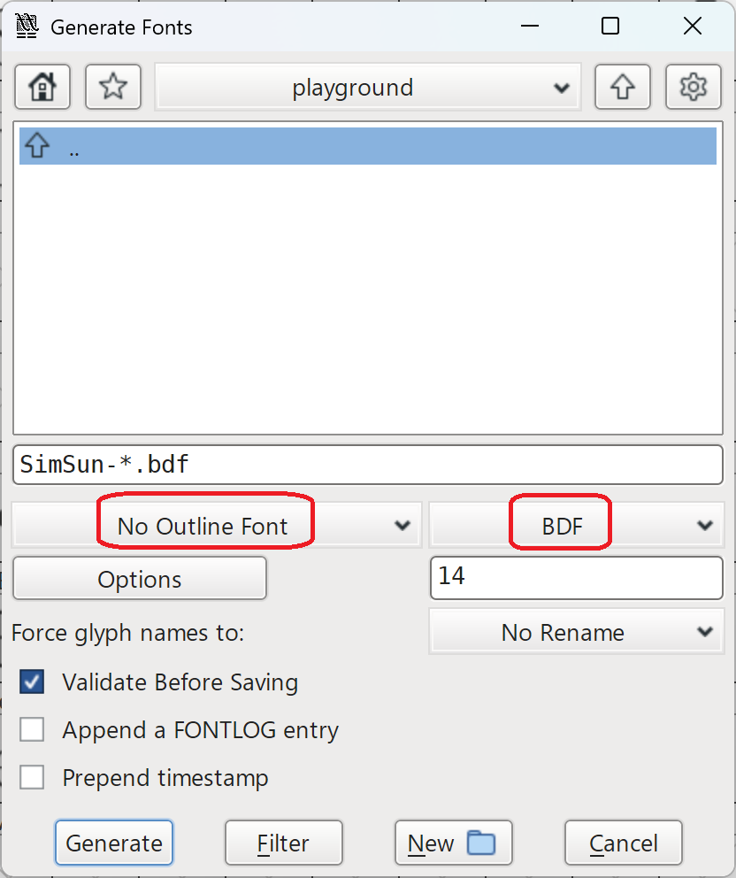

# Fonts

The client supports two font types:

- **TrueType** – TTF/OTF fonts. The client uses FontStashSharp to render these fonts.
- **SpriteFont** – precompiled XNA/MonoGame bitmap fonts (.xnb files).

> **Important:** TrueType and SpriteFont fonts cannot be mixed within a fallback chain. Fallback only works between TrueType fonts. A SpriteFont font index cannot fall back to a TrueType font, and vice versa. Each font index is entirely one type or the other.

Font configuration is done via `Fonts.ini` placed in your `Resources` directory.

## Fonts.ini location

The client searches for `Fonts.ini` in this order, loading the first one found:

1. Translation+Theme folder (e.g. `Translations/ko-KR/Allied/Fonts.ini`)
2. Theme folder (e.g. `Resources/Allied/Fonts.ini`)
3. Translation folder (e.g. `Translations/ko-KR/Fonts.ini`)
4. Base resources folder (`Resources/Fonts.ini`)

This lets translations supply their own fonts without touching the base configuration.

## Configuration

```ini
[TextShaping]
; HarfBuzz text shaping. Required for complex scripts (Arabic, Hebrew) and ZWJ emoji.
; Disable for simple Latin-only text (English, Spanish, French) and/or CJK-only text (Chinese, Japanese, Korean) for better performance.
Enabled=true
EnableBiDi=true       ; Bidirectional text support (mixed LTR/RTL)
CacheSize=100         ; Shaped text cache entries.

[Fonts]
Count=6   ; Total number of defined font indexes, including fallback fonts.

[Font0]
Type=TrueType               ; Type: "TrueType" or "SpriteFont"
Path=MozillaText-Bold.ttf   ; Path relative to the directory containing Fonts.ini
Size=14                     ; Font height in pixels (TrueType only; ignored for SpriteFont)
Fallback=4                  ; Optional. Index of the font to try when a character is missing.
                            ; The fallback font's own Fallback is followed recursively.

[Font1]
Type=TrueType
Path=MozillaText-Bold.ttf
Size=16
Fallback=4

[Font2]
Type=TrueType
Path=MozillaText-Bold.ttf
Size=18
Fallback=5

[Font3]
Type=TrueType
Path=MozillaText-Bold.ttf
Size=20
Fallback=5

; Font indexes used only as fallback targets — not referenced directly by UI controls.
[Font4]
Type=TrueType
Path=NotoSansSC-Regular.ttf
Size=14

[Font5]
Type=TrueType
Path=NotoSansSC-Regular.ttf
Size=18
```

Font paths are relative to the directory containing `Fonts.ini`. Both `/` and `\` are accepted.

### Properties reference

| Property | Applies to | Description |
|----------|-----------|-------------|
| `Type` | Both | `TrueType` or `SpriteFont` |
| `Path` | Both | File path relative to `Fonts.ini` directory. For SpriteFont, the `.xnb` extension is optional — it is stripped and re-appended automatically. |
| `Size` | TrueType | Font height in pixels. This is the em-square height. The actual rendered height of characters may be slightly smaller depending on the font's metrics. Ignored for fallback fonts. |
| `Fallback` | TrueType | Index of another TrueType font to use when a character is not found. The chain is followed recursively. Circular references are detected and ignored. |

## Character fallback

Fallback is configured **per font index** via the `Fallback` property. When rendering a character:

1. Try the primary font defined in the font index
2. If not found, follow the `Fallback` chain — load the font file from the referenced index, then that index's fallback, and so on
3. If still not found after the entire chain, renders as `?`

All fonts in a fallback chain render at the size specified in the **originating** font index, not the fallback target's size. The fallback target's `Size` is only used when that font index is itself the primary.

This per-font design allows different font indexes to have different fallback chains. For example, a bold font at size 20 can fall back to a different font than a regular font at size 14.

> **Note:** Fallback only works between TrueType fonts. SpriteFont indexes do not support fallback — if a character is missing from a SpriteFont, it renders as the default character (`?`).

## Font indexes

UI controls reference fonts by index, matching `[Font0]`, `[Font1]`, etc.:

```ini
[MyLabel]
FontIndex=1
```

```csharp
myLabel.FontIndex = 1;
```

## Recommended fonts
For English text:
- [Roboto_SemiCondensed-Medium.ttf](https://fonts.google.com/specimen/Roboto).
- [MozillaText-Medium.ttf](https://fonts.google.com/specimen/Mozilla+Text).

For CJK text:
- A Noto CJK font such as [NotoSansSC-Medium.ttf](https://fonts.google.com/noto/specimen/Noto+Sans+SC) (Chinese), [NotoSansKR-Medium.ttf](https://fonts.google.com/noto/specimen/Noto+Sans+KR) (Korean), or [NotoSansJP-Medium.ttf](https://fonts.google.com/noto/specimen/Noto+Sans+JP) (Japanese).

## Recommended pixel-perfect fonts

If you prefer the current SpriteFont rendering style, which is a pixel-perfect, sharp, non-anti-aliased font rendering, you can only choose a small subset of TTF/OTF fonts, and you must preprocess them.

For English text:
- Arial `arial.ttf` provided by Windows. It looks sharp after preprocessing at 14 px.
- Microsoft Sans Serif `micross.ttf` provided by Windows. It looks sharp after preprocessing at 14 px.

For CJK text, consider one of the following options:
- [GNU Unifont](https://unifoundry.com/unifont/). It has broad Unicode coverage and has pixel-perfect rendering. It supports 16 px as the font size ONLY. Does not have bold/italic variants.
- [WenQuanYi Bitmap Song TTF](https://github.com/AmusementClub/WenQuanYi-Bitmap-Song-TTF). This is already a "preprocessed" font with pixel-perfect rendering. Note that the font size does not correspond to the claimed size in the filename, say you need to specifiy `Size=15` for `WenQuanYi.Bitmap.Song.14px.ttf`. Does not have bold/italic variants.
- The default Windows Chinese font, SimSum `simsun.ttc`. It has pixel-perfect rendering on multiple sizes (we recommend 14 pixel) but you MUST follow the "Preprocess font files" instructions below to preprocess the font file before use. Does not have bold/italic variants.

## Examples

The following examples show how to set up `Fonts.ini`.

### English only

```ini
[TextShaping]
Enabled=false
EnableBiDi=false
CacheSize=100

[Fonts]
Count=4

[Font0]
Type=TrueType
Path=MozillaText-Bold.ttf
Size=14

[Font1]
Type=TrueType
Path=MozillaText-Bold.ttf
Size=16

[Font2]
Type=TrueType
Path=MozillaText-Bold.ttf
Size=18

[Font3]
Type=TrueType
Path=MozillaText-Bold.ttf
Size=20
```

### Korean translation with Chinese fallback

Korean font as primary, Chinese font as fallback for any characters the Korean font is missing.

```ini
[TextShaping]
Enabled=true
EnableBiDi=false
CacheSize=100

[Fonts]
Count=6

[Font0]
Type=TrueType
Path=NotoSansKR-Medium.ttf
Size=14
Fallback=4

[Font1]
Type=TrueType
Path=NotoSansKR-Medium.ttf
Size=16
Fallback=4

[Font2]
Type=TrueType
Path=NotoSansKR-Medium.ttf
Size=18
Fallback=5

[Font3]
Type=TrueType
Path=NotoSansKR-Medium.ttf
Size=20
Fallback=5

[Font4]
Type=TrueType
Path=NotoSansSC-Medium.ttf
Size=14

[Font5]
Type=TrueType
Path=NotoSansSC-Medium.ttf
Size=18
```

### English with CJK fallback

English font as primary, CJK font as fallback. Characters not in the English font (e.g. Chinese) automatically use the fallback.

```ini
[TextShaping]
Enabled=false
EnableBiDi=false
CacheSize=100

[Fonts]
Count=5

[Font0]
Type=TrueType
Path=MozillaText-Bold.ttf
Size=14
Fallback=4

[Font1]
Type=TrueType
Path=MozillaText-Bold.ttf
Size=16
Fallback=4

[Font2]
Type=TrueType
Path=MozillaText-Bold.ttf
Size=18
Fallback=4

[Font3]
Type=TrueType
Path=MozillaText-Bold.ttf
Size=20
Fallback=4

[Font4]
Type=TrueType
Path=NotoSansSC-Medium.ttf
Size=16
```

### SpriteFont (legacy)

```ini
[Fonts]
Count=4

[Font0]
Type=SpriteFont
Path=SpriteFont0

[Font1]
Type=SpriteFont
Path=SpriteFont1

[Font2]
Type=SpriteFont
Path=SpriteFont2

[Font3]
Type=SpriteFont
Path=SpriteFont3
```

The `.xnb` extension is optional in the `Path` — it will be added automatically if omitted. The files `SpriteFont0.xnb`, `SpriteFont1.xnb`, etc. must exist in the Resources folder.

## Preprocess font files

We recommend to preprocess TTF/OTF font files if you prefer the pixel-perfect rendering style similar to SpriteFont. Preprocessing generates a new TTF file with vector outlines optimized for a specific pixel size, which can significantly improve the rendering quality for certain fonts, especially CJK fonts with embedded bitmaps. However, not all fonts look better after preprocessing. Some might have a weird appearance.

Please follow the guideline below. We assume you have a Windows 10/11 PC, but similar steps should also work on Linux/Mac.

1. What's the extension of your font file?
    - If it's `.ttc`, follow the instructions in the "TTC fonts" section to extract a TTF file first.
    - If it's `.ttf` or `.otf`, continue to Step 2.

2. Download and install FontForge from https://fontforge.org/. Open your font file in FontForge. If FontForge shows a warning about "Bad Font Name", you can ignore this dialog.

3. Is there a "Load Bitmap Font" dialog?
    - Yes. This means your TTF/OTF file MUST be preprocessed. Select a font size (e.g. 14 px) and click "OK". Remember the size you chose. Jump to Step 5.
    - No. Your font file should work fine without preprocessing. However, you might still want to preprocess it if you prefer the pixel-perfect rendering style, but be sure to check the rendering quality in the end. Most fonts will look worse after preprocessing, but Arial and Microsoft Sans Serif are exceptions. Jump to Step 4 if you want to preprocess it, otherwise use the original TTF/OTF file directly in your `Fonts.ini` without preprocessing.

The dialog should look like this:



4. This step is only for users whose font file does not show the "Load Bitmap Font" dialog or the dialog does not contain the font size you expect. Select Element -> Bitmap Strikes Available. If "Pixel Sizes" is empty or does not contain the size you chose previously, you need to manually fill the pixel size and click "OK".





5. File -> Generate Fonts. Select "No Outline Font" and "BDF" as the font type, and save the file as `myfont.bdf`. Use 96 DPI as the BDF resolution, if being asked.



6. Open `myfont.bdf` in a text editor supporting opening large files, e.g., VSCode and EmEditor. Check if the first line is `STARTFONT 2.1` or `STARTFONT 2.2`.

7. If the first line is `STARTFONT 2.2`, you need to use https://github.com/SadPencil/BdfToolSP to downgrade the BDF file to version 2.1. Even not, you can still use BdfToolSP to clean up the BDF file by running the downgrade command. Besides, it's strongly recommended to run the downgrade command with `--font-name` parameter, so you can set up a new font name, e.g., "My Font 14px", to avoid conflicts with the original TTF/OTF file. We also stored a copy of BdfToolSP in `/AdditionalFiles/PreprocessFont` directory, but it might be outdated.

8. Check if `ENCODING 65` (character 'A') exists in the BDF file. This means whether the extracted bitmap font contains basic ASCII characters.
    - Yes. Jump to Step 11.
    - No. This means the extracted bitmap font does not contain basic ASCII characters, and you need to merge it with another font that contains the missing characters as a fallback target.

9. This step is only for users who need to provide fallback characters. Select a basic font, e.g., `micross.ttf`, `arial.ttf`. Open it with FontForge. Repeat Step 2 to Step 7 for this font, saving the font as `secondary.bdf`.

10. Use https://github.com/SadPencil/BdfToolSP to merge `myfont.bdf` and `secondary.bdf` into `merged.bdf`. Rename `merged.bdf` to `myfont.bdf`. Again, it's strongly recommended to run the merge command with `--font-name` parameter to set up a unique font name, to avoid conflicts.

11. Download and install the latest LTS version of Eclipse Temurin (previously named AdoptOpenJDK). You can skip this step if you already have JRE installed.

12. Download `BitsNPicas.jar` from https://github.com/kreativekorp/bitsnpicas/releases/. Generally speaking, you should download the latest version, but if you encounter issues, try v2.2. We also stored a copy in `/AdditionalFiles/PreprocessFont` directory, but it might be outdated.

13. Create the preprocessed TTF file by running `java -jar BitsNPicas.jar convertbitmap -f ttf -o myfont.ttf myfont.bdf`.

14. Double-click the TTF file. The sample text should display correctly. You might feel the font looks worse if the font size does not match the size you chose in Step 4, but this means you have successfully preprocessed the font file. You can now use this TTF file in your `Fonts.ini`, with the font size you chose in Step 4.

## TTC fonts

TTC (TrueType Collection) files bundle multiple fonts in one file. Only TTF/OTF files are supported — you need to extract the font you want from a TTC first.

Tools to extract TTF from TTC:

- Online: [everythingfonts.com/ttc-to-ttf](https://everythingfonts.com/ttc-to-ttf) or [transfonter.org/ttc-unpack](https://transfonter.org/ttc-unpack)

- Extract locally using Python and fonttools:
1. Install the latest Python 3.
2. Run `python3 -m venv venv` and `venv\Scripts\activate` (Windows) or `source venv/bin/activate` (Linux/Mac) to create and activate a virtual environment.
3. Run `pip install fonttools` (`pip install fonttools==4.62.1` if the latest version causes issues).
4. Create `extract_ttc.py` with the following content ([source](https://github.com/fonttools/fonttools/discussions/2647#discussioncomment-3093867)):
```python
#!/usr/bin/env python
from fontTools.ttLib.ttCollection import TTCollection
import os
import sys

filename = sys.argv[1]
ttc = TTCollection(filename)
basename = os.path.splitext(os.path.basename(filename))[0]
for i, font in enumerate(ttc):
    font.save(f"{basename}_{i}.ttf")
```
5. Run `python extract_ttc.py yourfont.ttc` to extract TTF files.

- Extract locally using BREAKTTC:
1. Download Microsoft TrueType SDK from https://archive.org/details/microsoft-truetype-sdk
2. Extract `TTC\breakttc.exe` from the SDK.
3. Download and install DosBox from https://www.dosbox.com/
4. Run `breakttc.exe yourfont.ttc` in DosBox to extract TTF files.

- See also: [Stack Overflow — Convert or extract TTC font to TTF](https://stackoverflow.com/questions/15455895/convert-or-extract-ttc-font-to-ttf-how-to)

## Known limitations

### No pixel-perfect rendering for embedded bitmap fonts

Some TTF/OTF fonts (especially CJK fonts like SimSun or WenQuanYi Zen Hei) contain embedded bitmap glyphs optimised for specific sizes. FontStashSharp does not use these embedded bitmaps — it always rasterizes from the vector outlines. This means these fonts may look blurrier than expected at their intended pixel sizes.

If you need pixel-perfect CJK rendering, either use a font whose vector outlines are already optimized for a specific pixel size (e.g., [Unifont](https://unifoundry.com/unifont/index.html) in 16 px, which has its bitmap data converted to vector outlines), or follow the "Preprocess font files" instructions above. In either case, there is only one optimal size for a preprocessed font, and using it at other sizes may look worse.

### SpriteFont has no fallback

SpriteFont indexes cannot use the `Fallback` property. If you need fallback for missing characters, use TrueType fonts for all your font indexes.

### No support for variable fonts

Different from TTC files, variable fonts (with `.ttf` or `.otf` extension) contain multiple font variations (e.g. different weights) in one file. The client does not support variable fonts.

### No support for fake-bold

Some fonts, especially CJK fonts like SimSun, only provide a regular weight without a bold variant. Windows provides a "fake bold" effect by algorithmically thickening the regular font when bold is requested. However, FontStashSharp does not support this fake bold effect. If you need a bold variant, you must choose a font file that includes an actual bold weight.

## Frequently Asked Questions

### How should I choose between TTF/OTF and SpriteFont?

Choose SpriteFont if:
1. You want extreme performance.
2. You want a pixel-perfect, non-anti-aliased rendering style.
3. You don't need fallback for missing characters.
4. You don't care about RTL text or complex scripts.
5. You need only ~10,000 characters or less.

Choose TTF/OTF if:
1. You don't mind the additional font rendering overhead.
2. You don't mind a slightly blurrier rendering style.
3. You need fallback for missing characters.
4. You need proper support for RTL text and complex scripts.
5. You need to cover a large character set.

### Can I use the preprocessed TTF font files as regular TTF fonts for other applications?

Definitely not! The preprocessed TTF files are essentially vectorized bitmap fonts that only look good at the specific size they were preprocessed for. Using them at other sizes or in other applications will likely result in poor rendering quality.

## Troubleshooting

**Font doesn't load** — check `client.log` for `FontManager:` messages and verify the file path and that it's a valid TTF/OTF.

**Wrong font used** — remember the primary font is tried first, then the fallback chain in order. Check no other `Fonts.ini` is being loaded from a different location.

**Characters render as `?`** — the character isn't in any font in the fallback chain. Add a font that covers it as a fallback target and set `Fallback` on the font index.

**Performance issues** — disable `TextShaping` if not needed, reduce fallback chain length, increase `CacheSize` if CPU or GPU usage is high, and decrease `CacheSize` if memory usage is high.
